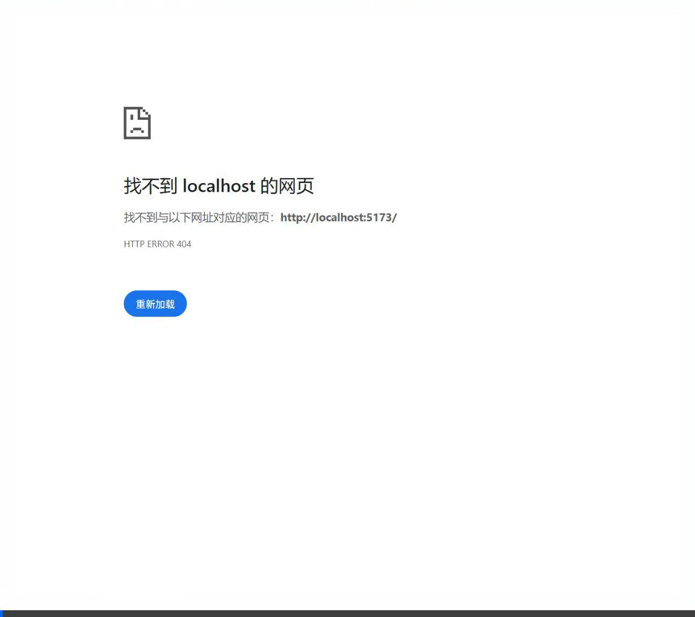

# Quont.ai - Advanced Quant Trading Engine & Backtest Simulator

<p align="center">
  
  
  
  
  
</p>

Quont.ai is a production-ready, fully-automated stock trading engine and interactive backtest simulator. Built with a Python FastAPI backend and a React (Vite) frontend, it features real-time K-line pattern recognition, dynamic market regime routing, ATR-based risk sizing, and out-of-sample walk-forward optimization.

<p align="center">
  <kbd>
    
  </kbd>
  <br>
  <sub>📱 <b>Mobile-Responsive Terminal Showcase</b> (Real-time Interactive Dashboard)</sub>
</p>

---

## 🚀 Key Features

### 1. 📊 Advanced K-Line Feature & Pattern Recognition
- **12 K-Line Numerical Features**: Computes body ratio, upper/lower shadow ratios, gaps, relative volume (RVOL), and trend context dynamically.
- **22 Quantifiable Candlestick Patterns**: Vectorized detection for patterns like Hammer, Shooting Star, Bullish/Bearish Engulfing, Piercing, Dark Cloud Cover, Morning/Evening Star, Three White Soldiers, Rising/Falling Three Methods, Gap Breakout, Exhaustion Gaps, and Neckline breakouts for W-Bottoms and M-Tops.

### 2. 🚦 Dynamic Market Regime Router
- Dynamically classifies the market into four regimes:
  - `trend_up`: Strong bullish trend. Activates trend-following strategies (Donchian breakout, EMA crossover).
  - `trend_down`: Bearish trend. Suspends buy operations and goes into defense.
  - `high_volatility`: Extreme volatility (ATR/Close in top 10%). Enforces cash preservation.
  - `range_bound`: Oscillating market. Activates mean reversion (Bollinger Bands oversold) and candlestick reversals.

### 3. 🛡️ Institutional-Grade Multi-Layer Risk Control
- **ATR-Based Sizing**: Calculates trade size based on account equity, ATR stop-distance, and risk percentage.
- **Soft Drawdown Limit (7%) & Consecutive Losses (5)**: Triggers a 50% reduction in position size.
- **Hard Drawdown Limit (12%)**: Temporarily locks the trading engine (risk multiplier goes to 0) to prevent capital blowups.

### 4. 🔄 Walk-Forward Parameter Optimization
- Features a rolling optimization pipeline (`walk_forward.py`) that divides history into training and test intervals.
- Optimizes parameters (strategy mode, ATR multiplier, RSI) by maximizing the drawdown-penalized net profit (Calmar-like metric) and validates performance out-of-sample.

---

## 📁 Project Structure

```text
├── backend/
│   ├── app/
│   │   ├── config.py           # Trade and risk configurations
│   │   ├── data_manager.py     # YFinance data loading, technical indicators, and regimes
│   │   ├── patterns.py         # 22 K-line patterns and W-Bottom/M-Top detection
│   │   ├── strategy.py         # Strategy routing and evaluation
│   │   ├── simulator.py        # Universal backtesting simulator
│   │   └── trading_engine.py   # Portfolio ledger, execution, and risk gates
│   ├── main.py                 # CLI Backtest interface
│   ├── main_api.py             # FastAPI REST Server
│   └── walk_forward.py         # Walk-Forward rolling optimization engine
├── frontend/                   # React Vite dashboard with TradingView charts
└── README.md
```

---

## 🛠️ Installation & Getting Started

### Prerequisites
- Python 3.8+
- Node.js 16+

### 1. Backend Setup
Navigate to the root directory and install dependencies:
```bash
pip install pandas numpy yfinance fastapi uvicorn pydantic
```

Run a CLI backtest simulation:
```bash
# Run minute-level day trading simulation for TSLA
python backend/main.py --ticker TSLA --period 5d --interval 1m

# Run daily-level swing trading simulation for TSLA
python backend/main.py --ticker TSLA --period 1y --interval 1d
```

Run Walk-Forward rolling parameter optimization:
```bash
python backend/walk_forward.py --ticker TSLA --period 1y --interval 1d
```

Start the FastAPI API server:
```bash
python backend/main_api.py
```

### 2. Frontend Setup
Navigate to the frontend folder, install dependencies, and start the development server:
```bash
cd frontend
npm install
npm run dev
```

---

## 📊 Backtest Indicators & Performance
Our universal backtest simulator calculates standard trading metrics including:
- **Net PnL & Return Percentage**
- **Max Account Equity Drawdown**
- **Win Rate & Round Trip Trade Count**
- **Transaction Commission and Slippage Friction Cost**
- **Market Regime Distributions**

---

## 📝 License & Disclaimer
This software is provided for educational and research purposes only. Algorithmic trading carries substantial risk, and past performance is not indicative of future results.
